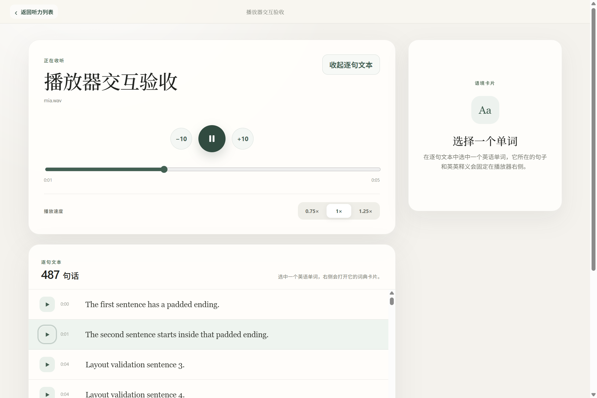

# 原境英语 · Origin English

原境英语是一款面向 Windows 的本地英语阅读与听力练习应用。它把文章阅读、上下文查词、生词本、原句朗读、本地音频转写和跟随文本练习放在同一个安静、适合长时间使用的桌面界面中。

> Current source and local desktop version: `0.2.2`. Latest public installer: `0.2.1`. The interface supports Chinese and English.


## 主要功能

- 导入并保存 UTF-8 Markdown 文章，在专注阅读页选择单词查义。
- 默认显示简明英英释义，中文释义按需展开。
- 使用本地词典真人录音朗读单词，并保存到紧凑生词本。
- 使用用户配置的 AI 服务生成更自然的原句朗读和语境说明。
- 导入 MP3 或 WAV，在本机使用 Small.EN 转写；可删除应用托管的音频副本和转写，不触碰原始源文件。
- 主音频连续播放、前后10秒、三档速度、句子跟随高亮和时间定位。
- 中文／英文界面切换。



## 本地功能与 AI 功能

不配置 API 也可以使用文章和音频管理、本地英英／英汉词典、生词本、词典真人发音以及 Small.EN 本地转写。

AI 服务由用户自行配置。当前支持 MiMo，以及用于文本能力的 OpenAI-compatible 服务。只有在用户主动使用对应功能时，应用才会向所配置的供应商发送所需文本；API Key 不会包含在本仓库或安装包中。更完整的边界见 [PRIVACY.md](PRIVACY.md)。

## 安装

正式安装包通过 GitHub Releases 提供，不提交进 Git 历史。`0.2.1` 的 Windows x64 安装包约 530 MiB，包含本地 Small.EN 模型和 whisper.cpp 运行库。

当前个人测试版尚未进行 Windows 代码签名，手动安装时可能出现 SmartScreen 提示。请只从本仓库的正式 Release 下载，并核对发布页提供的 SHA-256。

## 开发

已验证环境：Windows x64、Node.js 24、npm 11。

```powershell
npm ci
npm run typecheck
npm test
npm run build
```

启动开发版：

```powershell
npm run dev
```

## 准备本地转写资源

模型和原生运行库体积较大，不进入 Git 历史。首次使用本地转写或打包 Windows 安装程序前，显式运行：

```powershell
npm run transcription:prepare
npm run transcription:check
```

准备脚本只从清单中固定的 Hugging Face 与 whisper.cpp GitHub Release 地址下载资源，并逐文件校验 SHA-256。预计下载约485 MiB，占用约529 MiB磁盘。来源、版本和校验值记录在 [resources/transcription-assets.json](resources/transcription-assets.json)。

构建安装包：

```powershell
npm run release:win
```

`release:win`会先执行资源校验；资源缺失或哈希不符时会停止，不会静默使用其他模型或运行库。

## 数据与授权

- Simple English Wiktionary 派生词典遵循 CC BY-SA 4.0。
- ECDICT 派生中文参考遵循 MIT License。
- OpenAI Whisper 模型与 whisper.cpp 运行库遵循各自的 MIT License。
- 详细归属和许可证文本见 [THIRD_PARTY_NOTICES.md](THIRD_PARTY_NOTICES.md)。

除上述第三方内容外，原境英语自身源代码采用 [MIT License](LICENSE)。你可以使用、复制、修改和再分发代码，也可以用于商业用途，但需要保留版权与许可证声明。

## 仓库边界

以下内容只保留在开发者本机：API Key、正式学习资料、导入音频、转写结果、验收夹具、构建缓存、未打包目录和内部项目过程记录。安装包作为 GitHub Release 附件单独发布。
